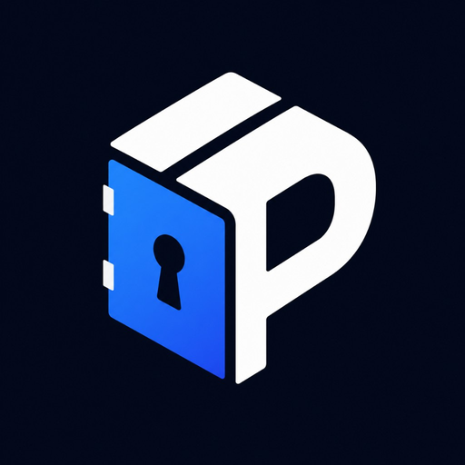

<p align="center">
  
</p>

# PackVault

**Secure Maven package hosting over local disk or S3-compatible storage.**

PackVault is a small, security-focused **Maven/Gradle artifact gateway**. It stores and serves JARs, POMs, checksums, and `maven-metadata.xml` using standard Maven HTTP layout. It is **not** a full [Nexus](https://sonatype.github.io/usage/maven/)/[Artifactory](https://jfrog.com/artifactory/) replacement: there is no package browser, Central proxy, vulnerability scanning, or `DELETE` in v1.

---

## Table of contents

- [What PackVault does](#what-packvault-does)
- [What PackVault does not do (v1)](#what-packvault-does-not-do-v1)
- [Prerequisites](#prerequisites)
- [Repository layout](#repository-layout)
- [Quick start with Docker Compose (recommended)](#quick-start-with-docker-compose-recommended)
- [Quick start from source (Python)](#quick-start-from-source-python)
- [Web UI](#web-ui)
- [Maven and Gradle clients](#maven-and-gradle-clients)
- [Configuration](#configuration)
- [Secrets and hashes](#secrets-and-hashes)
- [Storage backends](#storage-backends)
- [Authentication](#authentication)
- [Health checks](#health-checks)
- [Logging](#logging)
- [HTTP API summary](#http-api-summary)
- [Kubernetes (Helm)](#kubernetes-helm)
- [Development](#development)
- [Troubleshooting](#troubleshooting)
- [Further documentation](#further-documentation)
- [License](#license)

---

## What PackVault does

- **Maven-compatible HTTP**: `GET`, `HEAD`, and `PUT` on standard artifact paths.
- **Two storage modes**:
  - **Local disk** — simple, single-server deployments.
  - **S3-compatible storage** (AWS S3, LocalStack, etc.) — object storage as source of truth, with local cache.
- **Repository policy**: `releases` immutable by default (`409 Conflict` on overwrite); `snapshots` can allow overwrites.
- **Two auth channels**:
  - **Browser UI** — local username/password and optional Google SSO.
  - **Maven/Gradle** — HTTP Basic auth with scoped API tokens (hashed in config).
- **Operations**: `/startupz`, `/livez`, `/readyz`, Prometheus `/metrics`, structured logging, audit logs on writes.

---

## What PackVault does not do (v1)

- Proxy or cache Maven Central.
- Browse or search artifacts in the UI (dashboard shows config snippets only).
- `DELETE` artifacts via HTTP.
- UI-based token management (tokens are config/env only for now).
- Complex RBAC or per-user Maven permissions beyond token scopes.

---

## Prerequisites

| Tool                            | Version | Used for                                 |
|---------------------------------|---------|------------------------------------------|
| **Python**                      | 3.13.x  | Running from source, hash scripts, tests |
| **pip**                         | recent  | Installing PackVault                     |
| **Docker** + **Docker Compose** | recent  | Easiest way to run locally               |
| **Helm**                        | 3.x     | Optional Kubernetes install              |
| **curl**                        | any     | Testing HTTP endpoints                   |

You do **not** need Java or Maven installed on the PackVault server — only your **clients** (CI, laptops) need Maven or Gradle to publish and resolve.

---

## Repository layout

```text
packvault/
├── packvault/              # Python application
│   ├── main.py             # CLI entrypoint (packvault command)
│   ├── api/                # HTTP routes (Maven, UI, auth, health)
│   ├── auth/               # Local login, Google/OIDC, tokens, sessions
│   ├── config/             # Settings, YAML loading, ${env.*} substitution
│   ├── maven/              # Path rules, content types
│   ├── repositories/       # allowOverwrite policy
│   ├── runtime/            # AppState (shared runtime objects)
│   ├── storage/            # Local and S3 backends
│   ├── security/           # Path validation, security headers
│   ├── observability/      # Logging, metrics, health probe logic
│   └── ui/                 # HTML templates and static CSS
├── config/
│   ├── dev.yaml            # Local disk / dev (values from env)
│   ├── dev-localstack.yaml # LocalStack S3 + Secrets Manager dev config
│   └── example.yaml        # Documented static example
├── charts/packvault/       # Helm chart
├── docs/                   # Detailed guides
├── scripts/
│   ├── hash_password.py    # Argon2 hash for admin password
│   └── hash_token.py       # SHA-256 hash for Maven tokens
├── tests/
├── docker-compose.yaml
├── Dockerfile
├── env.example            # Template for .env (copy before Docker)
└── pyproject.toml
```

---

## Quick start with Docker Compose (recommended)

This is the easiest path if you are new to the project. Docker builds PackVault, wires configuration from a `.env` file, and persists artifacts on a volume.

### Step 1 — Clone and enter the project

```bash
git clone <your-repo-url> packvault
cd packvault
```

### Step 2 — Create `.env` from the template

```bash
cp env.example .env
```

Edit `.env` and set the **required** values (see [Secrets and hashes](#secrets-and-hashes) below). At minimum, you need:

- `PACKVAULT_SESSION_SECRET`
- `PACKVAULT_LOCAL_ADMIN_PASSWORD_HASH`
- `PACKVAULT_CI_TOKEN_HASH`
- `PACKVAULT_READER_TOKEN_HASH`

The template also sets sensible defaults for URLs, token names, logging, and storage paths.

### Step 3 — Generate secrets (on your machine)

From the project root, with Python 3.13 and PackVault installed (see [Quick start from source](#quick-start-from-source-python) for `pip install -e .`), or after `pip install -e .` in a venv:

```bash
# Session signing key (paste into PACKVAULT_SESSION_SECRET in .env)
python -c 'import secrets; print(secrets.token_urlsafe(48))'

# Admin UI password hash (choose a password, e.g. "admin")
python scripts/hash_password.py 'admin'

# Maven token secrets (choose your own raw secrets; remember them for clients)
python scripts/hash_token.py 'my-ci-secret'
python scripts/hash_token.py 'my-reader-secret'
```

Put the **hash** outputs into `.env`, not the raw passwords/tokens (except you must remember the raw token values for Maven/Gradle).

Example `.env` fragment after filling in:

```bash
PACKVAULT_SESSION_SECRET=your-long-random-string
PACKVAULT_LOCAL_ADMIN_PASSWORD_HASH=$argon2id$v=19$...
PACKVAULT_CI_TOKEN_HASH=sha256:...
PACKVAULT_READER_TOKEN_HASH=sha256:...
```

### Step 4 — Start PackVault (LocalStack + PostgreSQL)

```bash
docker compose up --build
```

- App URL: http://localhost:8080 (or the port from `PACKVAULT_HOST_PORT` in `.env`)
- Config file mounted: `config/dev-localstack.yaml` by default (S3 + Secrets Manager via LocalStack, PostgreSQL for app data)
- LocalStack: http://localhost:4566

To use local disk instead of S3, set `PACKVAULT_CONFIG=/config/dev.yaml` in `.env`.

### Step 5 — Sign in to the UI

1. Open http://localhost:8080
2. Log in with:
   - **Username**: value of `PACKVAULT_LOCAL_ADMIN_USERNAME` (default `admin`)
   - **Password**: the **plain** password you hashed (e.g. `admin`), not the hash string

The dashboard lists repositories and shows copy-paste Maven/Gradle snippets.

### Step 6 — Publish and download a test file

```bash
# Upload (replace token secret with the raw CI token you chose)
curl -u "ci-publisher:my-ci-secret" \
  -X PUT \
  --data-binary "hello" \
  http://localhost:8080/releases/com/example/demo/1.0.0/demo-1.0.0.txt

# Download with the reader token
curl -u "app-reader:my-reader-secret" \
  http://localhost:8080/releases/com/example/demo/1.0.0/demo-1.0.0.txt
```

You should see `hello` in the response.

### Local disk mode (optional)

Docker Compose defaults to LocalStack-backed S3. For local disk storage only, set in `.env`:

```env
PACKVAULT_CONFIG=/config/dev.yaml
```

Then run `docker compose up --build` as usual. LocalStack still starts but PackVault uses the on-disk backend.

---

## Quick start from source (Python)

Use this when developing PackVault itself or when you prefer not to use Docker.

### Step 1 — Python virtual environment

```bash
cd packvault
python3.13 -m venv .venv
source .venv/bin/activate    # Windows: .venv\Scripts\activate
pip install -e ".[dev]"
```

### Step 2 — Environment and config

```bash
cp env.example .env
# Edit .env and fill required secrets (same as Docker quick start)
```

Load variables into your shell (Docker Compose does this automatically; for local runs you must export them):

```bash
set -a
source .env
set +a

export PACKVAULT_CONFIG=config/dev.yaml
```

`PACKVAULT_CONFIG` tells PackVault which YAML file to load. The dev config expects every `${env.*}` placeholder to be set — missing variables cause a clear startup error.

### Step 3 — Run the server

```bash
packvault
```

Optional logging flags (override env and YAML):

```bash
packvault --log-level DEBUG --log-format standard
```

You should see log lines including the version, for example:

- `PackVault 0.1.0 starting`
- `PackVault 0.1.0 startup complete (storage=local, listen=0.0.0.0:8080)`

### Step 4 — Verify health

```bash
curl -s http://localhost:8080/livez | jq .
curl -s http://localhost:8080/startupz | jq .
curl -s http://localhost:8080/readyz | jq .
```

All should return HTTP 200 when the server is healthy.

---

## Web UI

| URL                  | Purpose                                                             |
|----------------------|---------------------------------------------------------------------|
| `/`                  | Landing; redirects to dashboard if logged in                        |
| `/login`             | Local username/password form                                        |
| `/auth/google/login` | Google SSO (only if `google` is in `auth.providers` and configured) |
| `/dashboard`         | Repositories, auth method, Maven/Gradle snippets                    |
| `/logout`            | Clears session cookie                                               |

The UI is for **operators**, not for browsing artifacts. Maven clients do not use the browser login flow.

---

## Maven and Gradle clients

### Repository URL pattern

Maven and Gradle use a **Nexus-style** base URL:

```text
http(s)://<host>/<repositoryName>/
```

Examples:

- `http://localhost:8080/releases`
- `http://localhost:8080/snapshots`

Artifacts are stored under paths like:

```text
/releases/com/acme/mylib/1.0.0/mylib-1.0.0.jar
```

### Authentication (HTTP Basic)

| Field        | Value                                                         |
|--------------|---------------------------------------------------------------|
| **Username** | Token **name** from config (e.g. `ci-publisher`)              |
| **Password** | Raw token secret (the string you hashed with `hash_token.py`) |

### Gradle (`build.gradle.kts`)

```kotlin
repositories {
    maven {
        url = uri("http://localhost:8080/releases")
        credentials {
            username = "ci-publisher"
            password = findProperty("packvaultToken") as String?
                ?: System.getenv("PACKVAULT_TOKEN")
        }
    }
}

publishing {
    repositories {
        maven {
            name = "packvaultReleases"
            url = uri("http://localhost:8080/releases")
            credentials {
                username = "ci-publisher"
                password = findProperty("packvaultToken") as String?
                    ?: System.getenv("PACKVAULT_TOKEN")
            }
        }
    }
}
```

### Maven (`settings.xml`)

```xml
<settings>
  <servers>
    <server>
      <id>packvault-releases</id>
      <username>ci-publisher</username>
      <password>YOUR_RAW_CI_TOKEN</password>
    </server>
  </servers>
</settings>
```

In your `pom.xml`, match the server `id` in `<distributionManagement>` or repository configuration.

More detail: [docs/publishing-gradle.md](docs/publishing-gradle.md) and [docs/configuration.md](docs/configuration.md).

---

## Configuration

PackVault loads a **YAML config file** and supports **environment variable substitution** inside that file.

### Config file path

| Variable           | Meaning                                                                                |
|--------------------|----------------------------------------------------------------------------------------|
| `PACKVAULT_CONFIG` | Path to YAML (used by the `packvault` CLI and container default `/config/config.yaml`) |

Example:

```bash
export PACKVAULT_CONFIG=config/dev.yaml
```

If the file is missing, startup fails with an explicit error.

### `${env.VAR}` in YAML

Any string value in YAML can reference an environment variable:

```yaml
server:
  sessionSecret: "${env.PACKVAULT_SESSION_SECRET}"
auth:
  local:
    passwordHash: "${env.PACKVAULT_LOCAL_ADMIN_PASSWORD_HASH}"
```

If `VAR` is not set, PackVault **refuses to start** (fail-fast for secrets).

See [docs/configuration.md](docs/configuration.md) for the full reference, repository layout, and Maven URL rules.

### Main configuration sections

| Section        | Purpose                                                    |
|----------------|------------------------------------------------------------|
| `storage`      | `backend: local` or `s3`, paths, bucket, cache settings    |
| `auth`         | `providers`, local admin hash, Maven tokens, Google/OIDC   |
| `repositories` | Named repos (`releases`, `snapshots`) and `allowOverwrite` |
| `security`     | `anonymousRead` (default `false`)                          |
| `server`       | Bind address, `publicUrl`, `sessionSecret`, upload limits  |
| `logging`      | `level` and `format` (`json` or `standard`)                |

Example templates:
- [config/dev.yaml](config/dev.yaml) — local disk development / Docker
- [config/dev-localstack.yaml](config/dev-localstack.yaml) — LocalStack S3 + Secrets Manager (Docker default)

### Environment variable reference (`env.example`)

Copy [env.example](env.example) to `.env`. Important variables:

| Variable                              | Required                | Description                                                  |
|---------------------------------------|-------------------------|--------------------------------------------------------------|
| `PACKVAULT_SESSION_SECRET`            | Yes                     | Signs browser session cookies                                |
| `PACKVAULT_LOCAL_ADMIN_PASSWORD_HASH` | Yes (if local auth)     | Argon2 hash from `hash_password.py`                          |
| `PACKVAULT_CI_TOKEN_HASH`             | Yes (if using CI token) | SHA-256 hash from `hash_token.py`                            |
| `PACKVAULT_READER_TOKEN_HASH`         | Optional                | Read-only token hash                                         |
| `PACKVAULT_LOCAL_ADMIN_USERNAME`      | No                      | Default `admin`                                              |
| `PACKVAULT_CI_TOKEN_NAME`             | No                      | Default `ci-publisher`                                       |
| `PACKVAULT_READER_TOKEN_NAME`         | No                      | Default `app-reader`                                         |
| `PACKVAULT_PUBLIC_URL`                | No                      | Default `http://localhost:8080`                              |
| `PACKVAULT_ANONYMOUS_READ`            | No                      | `true` or `false`                                            |
| `PACKVAULT_LOG_LEVEL`                 | No                      | `DEBUG`, `INFO`, `WARN`, `ERROR`                             |
| `PACKVAULT_LOG_FORMAT`                | No                      | `json` or `standard`                                         |
| `PACKVAULT_LOCAL_ROOT`                | No                      | Local storage directory, default `/data` in containers       |
| `PACKVAULT_S3_*`                      | For S3 mode             | Endpoint, bucket, region, prefix, and S3-compatible settings |
| `PACKVAULT_AWS_*`                     | LocalStack / AWS        | Shared endpoint, region, and credentials for boto3 clients   |
| `PACKVAULT_SECRETS_MANAGER_SECRET_ID` | With encryption         | Secrets Manager secret id for the master key                 |

For S3 and Secrets Manager, Docker Compose sets `AWS_ACCESS_KEY_ID` and `AWS_SECRET_ACCESS_KEY` from `PACKVAULT_AWS_ACCESS_KEY_ID` / `PACKVAULT_AWS_SECRET_ACCESS_KEY` (LocalStack default: `test` / `test`).

In Kubernetes, prefer cloud-native identity such as Pod Identity, IRSA, workload identity, or Secret-backed environment variables instead of storing static S3 credentials in ConfigMaps.

---

## Secrets and hashes

**Never put raw passwords or Maven tokens in YAML committed to git.** Store only hashes in config (or inject hashes via env substitution).

| Secret         | How to generate                                                | Stored in                             |
|----------------|----------------------------------------------------------------|---------------------------------------|
| Session key    | `python -c 'import secrets; print(secrets.token_urlsafe(48))'` | `PACKVAULT_SESSION_SECRET`            |
| Admin password | `python scripts/hash_password.py 'your-password'`              | `PACKVAULT_LOCAL_ADMIN_PASSWORD_HASH` |
| Maven token    | `python scripts/hash_token.py 'your-raw-token'`                | `PACKVAULT_CI_TOKEN_HASH`, etc.       |

Maven clients use the **raw** token as the Basic auth password; PackVault compares a hash of that value to the configured `tokenHash`.

Token permissions are defined in YAML under `auth.tokens` (repository name + `read` / `write` actions). Optional `expiresAt` is supported (ISO-8601 datetime).

---

## Storage backends

### Local (`storage.backend: local`)

- Artifacts live under `storage.local.root`.
- The default runtime path is `/data`.
- **One replica** — do not share the same local data directory across multiple PackVault instances.
- Best for: laptop, single VM, Docker Compose local mode, or a single Kubernetes replica with a PVC.

### S3-compatible (`storage.backend: s3`)

- Artifacts live in a bucket (`storage.s3.bucket`) with optional `prefix`.
- Supports AWS S3, LocalStack, and other S3-compatible endpoints via `endpointUrl` and `pathStyle`.
- PackVault uses the configured cache path as a local read-through/write-through artifact cache.
- The default cache path is `/data`; in S3 mode this path is disposable because object storage is the source of truth.
- Multiple application replicas can safely use the same bucket. In Kubernetes, make sure each replica has its own local workspace/cache volume unless you intentionally provide shared RWX storage.

| Mode              | Compose config                                    | Command                     |
|-------------------|---------------------------------------------------|-----------------------------|
| LocalStack (default) | `PACKVAULT_CONFIG=/config/dev-localstack.yaml` | `docker compose up --build` |
| Local disk        | `PACKVAULT_CONFIG=/config/dev.yaml`            | `docker compose up --build` |

---

## Authentication

### Human (browser)

Configured under `auth.providers`:

| Provider | Config block  | Notes                                                          |
|----------|---------------|----------------------------------------------------------------|
| `local`  | `auth.local`  | Username + `passwordHash` (argon2)                             |
| `google` | `auth.google` | `clientId`, `clientSecret`; set `PACKVAULT_GOOGLE_*` in `.env` |
| `oidc`   | `auth.oidc`   | Generic OIDC (wired for future use)                            |

Session cookie: `packvault_session` (`HttpOnly`, `SameSite=Lax`; `Secure` when `publicUrl` is `https://`).

### Maven / Gradle (machines)

- HTTP **Basic** auth only in v1.
- Tokens are defined in config with scoped permissions per repository.
- No browser SSO for Maven — use a dedicated token per CI job or application.

---

## Health checks

PackVault exposes three probe endpoints (Kubernetes-friendly):

| Endpoint    | Probe type | What it checks                                                     |
|-------------|------------|--------------------------------------------------------------------|
| `/startupz` | Startup    | One-time initialization finished (including initial storage check) |
| `/livez`    | Liveness   | Process is up; not shutting down; **no** storage I/O               |
| `/readyz`   | Readiness  | Startup done + storage reachable **now** (safe for traffic)        |

| HTTP status | Meaning      |
|-------------|--------------|
| `200`       | Probe passed |
| `503`       | Probe failed |

JSON body includes `status` (e.g. `ok`, `starting`, `ready`, `not_ready`, `shutting_down`) and optional `detail`.

**Typical behavior:**

- **S3 outage**: `/livez` stays 200; `/readyz` returns 503 (traffic drained, pod not restarted).
- **During boot**: `/startupz` and `/readyz` are 503 until startup completes.
- **Shutdown**: `/readyz` and `/livez` fail with `shutting_down`.

Details: [docs/operations.md](docs/operations.md).

---

## Logging

Controlled by config, environment, and CLI (precedence: **CLI > env > YAML > default**).

| Setting | Environment            | CLI flag       | Default |
|---------|------------------------|----------------|---------|
| Level   | `PACKVAULT_LOG_LEVEL`  | `--log-level`  | `INFO`  |
| Format  | `PACKVAULT_LOG_FORMAT` | `--log-format` | `json`  |

**Formats:**

- **`json`** — structured logs for production (timestamp, level, logger, module, filename, line, message, optional `request_id`).
- **`standard`** — single-line human-readable logs for local debugging.

**Audit logs** (`packvault.audit` logger) record artifact writes (repository, path, principal, client IP, bytes) and never include secrets or `Authorization` headers.

---

## HTTP API summary

### Maven artifact API

| Method | Path                   | Auth                    | Notes                                            |
|--------|------------------------|-------------------------|--------------------------------------------------|
| `GET`  | `/{repository}/{path}` | Token or anonymous read | Download artifact                                |
| `HEAD` | `/{repository}/{path}` | Same                    | Metadata / existence check                       |
| `PUT`  | `/{repository}/{path}` | Token with write scope  | Upload; `201` created; `409` if immutable exists |

There is **no** `DELETE` in v1.

### UI and auth

| Method | Path                                          | Purpose          |
|--------|-----------------------------------------------|------------------|
| `GET`  | `/`, `/login`, `/dashboard`                   | Web UI           |
| `POST` | `/login`                                      | Local login form |
| `GET`  | `/auth/google/login`, `/auth/google/callback` | Google SSO       |
| `GET`  | `/logout`                                     | End session      |

### Operations

| Method | Path                             | Purpose            |
|--------|----------------------------------|--------------------|
| `GET`  | `/startupz`, `/livez`, `/readyz` | Health probes      |
| `GET`  | `/metrics`                       | Prometheus metrics |

### Error responses

Application errors return JSON like:

```json
{
  "error": {
    "code": "not_found",
    "message": "Artifact not found"
  },
  "request_id": "uuid-here"
}
```

Common codes: `bad_request`, `unauthorized`, `forbidden`, `not_found`, `conflict`, `service_unavailable`.

---

## Kubernetes (Helm)

```bash
helm install packvault ./charts/packvault \
  -f charts/packvault/values.yaml
```

The chart supports:

- `startupProbe` → `/startupz`
- `livenessProbe` → `/livez`
- `readinessProbe` → `/readyz`
- ConfigMap rendering from `.Values.config`
- Secret placeholders using `${env.NAME}` inside the rendered config
- `extraEnv` for Kubernetes Secret-backed environment variables
- One workspace mount at `/data`
- Optional PVC through `persistence.enabled`
- Deployment strategy helper:
  - `Recreate` for `config.storage.backend=local`
  - `RollingUpdate` for `config.storage.backend=s3`

The chart intentionally keeps secret-like values out of the ConfigMap. Values such as `PACKVAULT_SESSION_SECRET`, `PACKVAULT_LOCAL_ADMIN_PASSWORD_HASH`, and token hashes should be supplied through `extraEnv` from Kubernetes Secrets.

Adjust `image.repository`, `ingress`, `config.server.publicUrl`, `config.storage.backend`, persistence, and `replicaCount` in [charts/packvault/values.yaml](charts/packvault/values.yaml).

---

## Development

### Branding assets

Icons and favicons are generated from a single master file: [`packvault/ui/static/branding/logo.png`](packvault/ui/static/branding/logo.png). See [`packvault/ui/static/branding/README.md`](packvault/ui/static/branding/README.md) for sizes and usage.

After changing `logo.png`, regenerate derivatives:

```bash
pip install pillow   # or pip install -e ".[dev]"
python scripts/generate_branding_assets.py
```

Programmatic paths: `packvault.ui.branding` (`LOGO_SOURCE`, `icon_png()`, `icon_static_url()`).

### Run tests

```bash
pip install -e ".[dev]"
pytest -v
```

### Lint and typecheck

```bash
ruff check packvault tests
pyright packvault
```

### Version bump

Edit [packvault/__version__.py](packvault/__version__.py). Hatch reads it for package metadata (`dynamic = ["version"]` in `pyproject.toml`).

### CI

GitHub Actions (`.github/workflows/ci.yaml`) runs Ruff, pytest, Python package build, Helm lint, and a Docker build on push/PR.

---

## Troubleshooting

### PackVault exits immediately on start

- **Missing env var**: If using `config/dev.yaml`, every `${env.VAR}` must be set. Check the error for the variable name. Run `source .env` before `packvault`, or use Docker Compose with a filled `.env`.
- **Missing config file**: Set `PACKVAULT_CONFIG` to a valid path.
- **Invalid hash**: Regenerate with `scripts/hash_password.py` or `scripts/hash_token.py`.

### `401 Unauthorized` from Maven/curl

- Username must match the token **name** in config (e.g. `ci-publisher`).
- Password must be the **raw** token secret, not the `sha256:...` hash.
- Token must have `read` or `write` on the target repository.

### `403 Forbidden`

- Token is valid but lacks permission for that repository or action.

### `409 Conflict` on PUT

- Uploading to `releases` when the artifact already exists (`allowOverwrite: false`). Use `snapshots` or a new version path.

### `503` on `/readyz` but `/livez` is OK

- Storage is temporarily unreachable (common with S3/LocalStack). The pod should not be restarted; fix storage or networking.

### Docker Compose: empty password hash errors

- Ensure `.env` exists and `PACKVAULT_LOCAL_ADMIN_PASSWORD_HASH` and token hashes are filled in before `docker compose up`.

### Cannot log in to UI

- Use the **plain** admin password, not the argon2 hash string.
- Confirm `local` is listed under `auth.providers`.

---

## Further documentation

| Document                                               | Topics                                 |
|--------------------------------------------------------|----------------------------------------|
| [docs/configuration.md](docs/configuration.md)         | URLs, `${env.*}`, logging, client auth |
| [docs/security.md](docs/security.md)                   | Defaults, immutability, audit          |
| [docs/operations.md](docs/operations.md)               | Health probes, metrics                 |
| [docs/publishing-gradle.md](docs/publishing-gradle.md) | Gradle publishing example              |
| [env.example](env.example)                             | All environment variables explained    |

---

## License

MIT — see [LICENSE](LICENSE).
